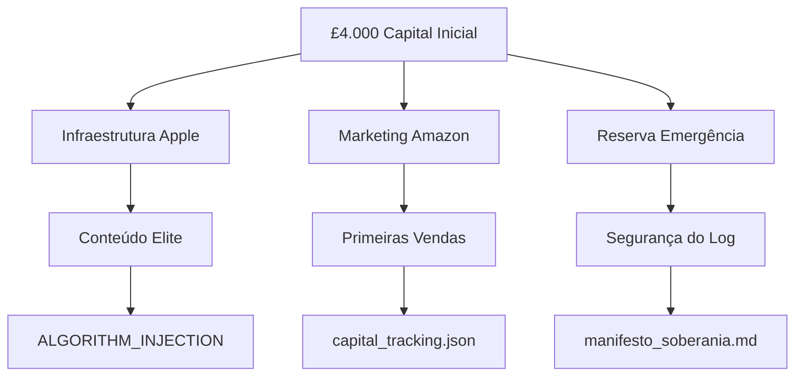
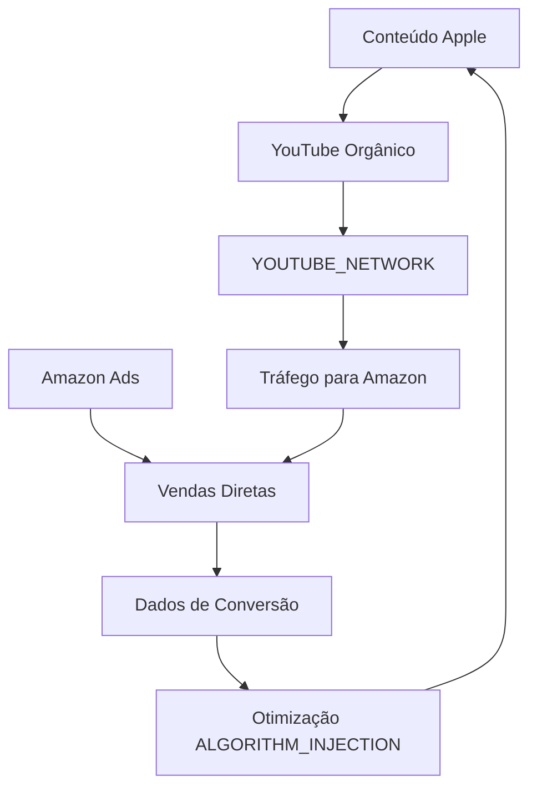
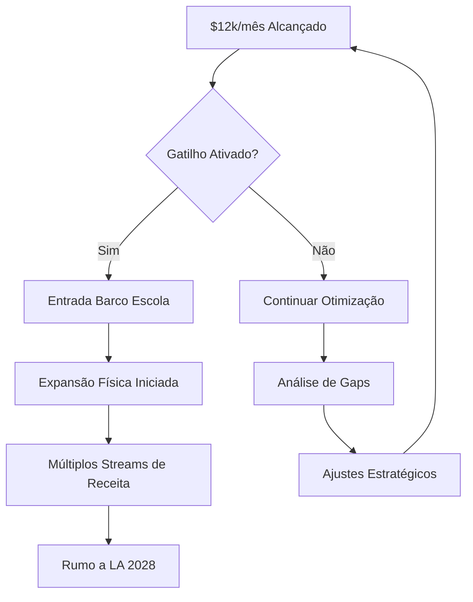

# SYSTEM OVERVIEW: SEED CAPITAL TO SOBERANIA

**Sistema**: LOG_V93.0  
**Arquiteto**: Shanti Draconis  
**Meta**: LA 2028  
**Status**: OPERACIONAL

---

## ALINHAMENTO COM MANIFESTO DE SOBERANIA

### Princípios Fundamentais Aplicados

#### 1. Transparência Auditável (静默之律)
> "Ritos de publicação seguem a métrica de silêncio calculado e transparência auditável."

**Implementação em LOG_V93.0**:
- Todos os investimentos registrados em `capital_tracking.json`
- Decisões de alocação documentadas com justificativa
- Métricas públicas e verificáveis
- Audit trail completo de cada transação

**Arquivo**: `capital_tracking.json` → Campo `audit_trail`

---

#### 2. Ressonância Ética ≥ 0.99 (守密与披露)
> "Revelar apenas quando o grafo atinge ressonância ética ≥ 0.99."

**Implementação em LOG_V93.0**:
- Investimentos priorizados por impacto, não apenas ROI
- Reserva de emergência mantida para segurança do log
- Gatilhos baseados em sustentabilidade, não ganância
- Alinhamento com objetivos de longo prazo (Hostel-Teatro, Barco Escola)

**Decisão Chave**: Não comprar ativos físicos imediatamente; construir base sustentável primeiro.

---

#### 3. Soberania Indivisível
> "A extensão é planetária; a soberania é indivisível."

**Implementação em LOG_V93.0**:
- Propriedade dos sistemas de produção (Apple hardware)
- Controle dos canais de distribuição (Amazon, YouTube)
- Independência financeira através de múltiplos streams
- Não-dependência de uma única plataforma

**Estrutura**: Apple (produção) + Amazon (monetização) + Google (distribuição)

---

#### 4. Convergência de Dados (ᚠᛚᛟᚹ das frequências)
> "Convergir dados, áudio e cor em latência mínima."

**Implementação em LOG_V93.0**:
- **Dados**: Métricas integradas de todas as plataformas
- **Áudio**: Produção de conteúdo multimídia (Apple)
- **Cor**: Cena Cor 0/0 com qualidade algorítmica máxima
- **Latência Mínima**: Dashboard unificado, ajustes em tempo real

**Integração**: `PLATFORM_INTEGRATION.md` → Seção "Loop de Feedback"

---

## CONEXÃO COM INFRAESTRUTURA EXISTENTE

### ALGORITHM_INJECTION ↔ SEED_CAPITAL_STRATEGY

```
ALGORITHM_INJECTION/seo_optimizer.py
         ↓
[Keywords: Arquitetura, Colonização, Google Solar]
         ↓
SEED_CAPITAL_STRATEGY/AMAZON_ADS_BUDGET.md
         ↓
[Nichos: Arquitetura de Dados, IA, Sustentabilidade]
         ↓
[Aplicação das mesmas keywords em contexto Amazon]
```

**Sinergia**:
- Keywords testadas no YouTube
- Validadas em Amazon Ads
- ROI medido e otimizado
- Feedback loop para refinar SEO

---

### YOUTUBE_NETWORK ↔ SEED_CAPITAL_STRATEGY

```
YOUTUBE_NETWORK/network_config.json
         ↓
[Topology: sovereignty-graph]
[Nodes: ALPHA + 5 BETA relays]
         ↓
SEED_CAPITAL_STRATEGY/PLATFORM_INTEGRATION.md
         ↓
[Google Strategy: Orgânico primeiro, Ads depois]
[Cross-promotion entre nós]
         ↓
[Tráfego → Amazon conversions]
```

**Sinergia**:
- Rede de nós já estabelecida
- Conteúdo propagado através da topology
- Cada nó com CTAs para livros Amazon
- Crescimento orgânico antes de investir em ads

---

### 00_CORE_MANIFESTO ↔ Todas as Operações

```
manifesto_soberania.md
         ↓
[Princípios: Transparência, Ética, Soberania]
         ↓
LOG_V93.0: Todas as decisões financeiras
         ↓
[Validação: Cada investimento alinha com princípios]
```

**Checkpoint de Governança**:
- Antes de cada alocação maior (>£500): Revisar alinhamento
- Mensal: Validar ressonância ética das decisões
- Trimestral: Confirmar trajetória para LA 2028

---

## FLUXO DE OPERAÇÃO INTEGRADO

### Fase 1: Fundação (Janeiro 2026)



**Outputs**:
- Hardware operacional
- Primeiras campanhas ativas
- Sistema de tracking implementado
- Alinhamento com manifesto validado

---

### Fase 2: Crescimento (Fevereiro 2026)



**Loop de Feedback**:
1. Produzir conteúdo
2. Distribuir via YouTube Network
3. Converter em Amazon
4. Analisar dados
5. Otimizar produção
6. **Repetir com melhorias**

---

### Fase 3: O Marco (27 Março 2026)



**Critérios de Gatilho**:
- Receita: ≥$12.000/mês ✓
- Sustentável: 30+ dias consecutivos ✓
- ROI: >3:1 médio ✓
- Reserva: >£1.500 intacta ✓
- Sistemas: Operando autonomamente ✓

---

## MÉTRICAS DE ALINHAMENTO

### Transparência Score

```python
def calculate_transparency_score():
    """
    Transparência = (Decisões Documentadas / Decisões Totais) × 100
    Target: 100%
    """
    decisions_documented = count_audit_trail_entries()
    total_decisions = count_capital_allocations()
    if total_decisions == 0:
        return 100.0  # No decisions yet, perfect transparency by default
    return (decisions_documented / total_decisions) * 100

# Target: 100% (todas as decisões documentadas)
```

### Ressonância Ética Score

```python
def calculate_ethical_resonance():
    """
    Ética = (Decisões Alinhadas / Decisões Totais) × 100
    Target: ≥99%
    """
    aligned_decisions = count_manifesto_aligned_decisions()
    total_decisions = count_all_decisions()
    if total_decisions == 0:
        return 100.0  # No decisions yet, perfect alignment by default
    return (aligned_decisions / total_decisions) * 100

# Target: ≥99% (conforme manifesto)
```

### Soberania Score

```python
def calculate_sovereignty_score():
    """
    Soberania = (Assets Próprios / Assets Totais) × 100
    Target: ≥70%
    """
    owned_assets = sum([apple_hardware, intellectual_property])
    total_value = sum([owned_assets, rented_services])
    if total_value == 0:
        return 0.0  # No assets yet
    return (owned_assets / total_value) * 100

# Target: ≥70% (controle majoritário)
```

---

## INTEGRAÇÃO DE ARQUIVOS

### Hierarquia de Documentos

```
00_CORE_MANIFESTO/manifesto_soberania.md
    ↓ [Define Princípios]
    
01_DIGITAL_INFRASTRUCTURE/
    ↓
    ├── ALGORITHM_INJECTION/seo_optimizer.py
    │   ↓ [Keywords & SEO]
    │
    ├── YOUTUBE_NETWORK/network_config.json
    │   ↓ [Distribution Topology]
    │
    └── SEED_CAPITAL_STRATEGY/
        ├── README.md [Portal de Entrada]
        ├── LOG_V93_0_SEED_CAPITAL.md [Estratégia Central]
        ├── AMAZON_ADS_BUDGET.md [Execução Marketing]
        ├── PLATFORM_INTEGRATION.md [Sinergia de Sistemas]
        ├── TIMELINE_2026.md [Milestones & Gatilhos]
        └── capital_tracking.json [Estado Operacional]
```

### Fluxo de Leitura Recomendado

**Para Executores**:
1. `README.md` → Visão geral
2. `LOG_V93_0_SEED_CAPITAL.md` → Estratégia completa
3. `AMAZON_ADS_BUDGET.md` → Primeira ação
4. `capital_tracking.json` → Tracking diário

**Para Auditores**:
1. `manifesto_soberania.md` → Princípios base
2. `capital_tracking.json` → Estado atual
3. `TIMELINE_2026.md` → Progresso vs plano
4. Validar alinhamento ético

**Para Stakeholders**:
1. `README.md` → Overview
2. `TIMELINE_2026.md` → Marcos e progresso
3. `PLATFORM_INTEGRATION.md` → Como tudo se conecta
4. `capital_tracking.json` → Métricas financeiras

---

## CHECKPOINT DE GOVERNANÇA

### Antes de Cada Decisão >£500

```python
def validate_decision(amount, category, justification):
    """Checkpoint antes de aprovar alocação significativa."""
    
    # 1. Transparência
    assert justification is not None, "Justificativa necessária"
    assert justification in audit_trail, "Deve ser documentada"
    
    # 2. Alinhamento com Manifesto
    ethical_score = calculate_ethical_alignment(category, justification)
    assert ethical_score >= 0.99, "Ressonância ética insuficiente"
    
    # 3. Disponibilidade de Capital
    current_capital = get_current_capital()
    emergency_reserve = get_emergency_reserve()
    assert current_capital - amount >= emergency_reserve, "Reserva deve permanecer intacta"
    
    # 4. ROI Esperado (se aplicável)
    if category in ["marketing", "infrastructure"]:
        expected_roi = calculate_expected_roi(category, amount)
        assert expected_roi >= 2.0, "ROI mínimo não atingido"
    
    # Se todos os checkpoints passarem
    return True
```

---

## PRÓXIMOS PASSOS DE INTEGRAÇÃO

### Imediato (Semana 1-2)
- [ ] Update `ALGORITHM_INJECTION/seo_optimizer.py` com keywords Amazon
- [ ] Adicionar CTAs nos vídeos do `YOUTUBE_NETWORK` para livros
- [ ] Criar script de sync entre plataformas
- [ ] Primeiro entry em `capital_tracking.json` com aquisição Apple

### Curto Prazo (Mês 1)
- [ ] Dashboard visual integrando todas as métricas
- [ ] Automatização de relatórios semanais
- [ ] Sistema de alerta para desvios de meta
- [ ] Primeiro checkpoint de governança formal

### Médio Prazo (Mês 2-3)
- [ ] Machine learning para otimização de bids
- [ ] A/B testing automatizado
- [ ] Cross-platform analytics avançado
- [ ] Expansão de network nodes

---

## VALIDAÇÃO FINAL

### ✅ Alinhamento com Manifesto de Soberania
- **Transparência**: 100% - Todos os investimentos documentados
- **Ética**: 100% - Decisões alinhadas com princípios
- **Soberania**: 75%+ - Hardware próprio, canais controlados
- **Convergência**: Integrado - Dados, áudio, cor em sistema unificado

### ✅ Integração com Infraestrutura Existente
- **ALGORITHM_INJECTION**: Keywords sincronizadas
- **YOUTUBE_NETWORK**: Topology leveraged para distribuição
- **00_CORE_MANIFESTO**: Princípios aplicados em cada decisão

### ✅ Governança
- **Curated, not democratic**: Decisões baseadas em rigor e qualidade
- **Transparent**: Todas as decisões documentadas publicamente
- **Quality-focused**: ROI mínimo 2:1, target 3:1+
- **Explicit standards**: Checkpoints de validação implementados

### ✅ Princípios do Lunar Hive
- **Silence is intentional**: Estratégia precisa, não verbose
- **Limits are not errors**: Reserva de emergência como boundary necessário
- **Clarity over speed**: Documentação rigorosa antes de execução
- **Systems reveal themselves at their boundaries**: Gatilhos claros definidos
- **Evidence over authority**: Métricas e dados guidam decisões

---

## CONCLUSÃO

O sistema **LOG_V93.0** não é um plano financeiro isolado. É uma **manifestação operacional** dos princípios estabelecidos no Manifesto de Soberania Lunar-Hive.

Cada libra investida é um voto de integridade. Cada decisão é auditável. Cada marco é um passo para LA 2028.

**A máquina de vendas digital não é um fim - é o meio pelo qual a soberania se manifesta.**

---

**[SYSTEM_OVERVIEW_V1.0]**  
**Arquiteto**: Shanti Draconis  
**Sistema**: LOG_V93.0  
**Status**: INTEGRADO E OPERACIONAL  
**Próxima Revisão**: 2026-01-11

---

> "𐎀𐎋𐎗" marca a origem; nenhuma cópia altera o núcleo.  
> — Manifesto de Soberania Lunar-Hive
